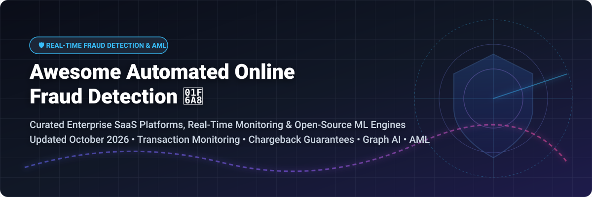

# Awesome-Automated-Online-Fraud-Detection 🛡️ 🚨

  

  
  
  
  
  
  

---

## 🌟 Top Automated Online Fraud Detection Ecosystem

**Curated List of Commercial Fraud Prevention Platforms & Open-Source Detection Engines**  
*Focused on Real-Time Transaction Monitoring, Chargeback Guarantees, AML Screening, Account Takeover Prevention & Self-Hosted Risk Scoring*

**Last updated: October 2026** 📅

---

### 📌 Overview & SEO Summary

Welcome to the ultimate curated directory of **automated online fraud detection platforms**, **real-time transaction monitoring engines**, and **open-source fraud prevention frameworks**. Whether you are looking for enterprise-grade commercial solutions (such as *Forter*, *Kount*, *Sift*, *Signifyd*, and *SEON*), or self-hostable open-source alternatives (like *PyOD*, *Marble*, *DGFraud*, and *AMLSim*), this list covers category leaders, chargeback guarantees, AML compliance tools, and privacy-respecting risk engines.

---

## 📑 Table of Contents

- [🏢 SaaS & Commercial Platforms](#-saas--commercial-platforms)
- [🔓 Open-Source GitHub Projects](#-open-source-github-projects)
- [🛠️ How to Contribute](#%EF%B8%8F-how-to-contribute)
- [📊 Star History](#-star-history)
- [🤝 Support & Sponsorship](#-support--sponsorship)
- [⚠️ Disclaimer](#%EF%B8%8F-disclaimer)

---

## 🏢 SaaS / Commercial Platforms

> **Market Intelligence Note:** The global automated online fraud detection market size is estimated at **$31.5 Billion in 2026** (projected to reach **$65+ Billion by 2030** at a CAGR of ~18.5%). The sector is **moderately fragmented**, with competition spread across cloud giants (AWS), established identity bureaus (Equifax/Kount), specialized AI fraud unicorns (Forter, Sift, Signifyd, Feedzai), and specialized digital footprint security providers (SEON, Arkose Labs).
>
> *Note: Amazon Fraud Detector was retired for new customers on November 7, 2025. AWS recommends SageMaker AutoGluon and AWS WAF for equivalent detection workflows.*

*Sorted by Company Valuation / Market Cap / Revenue (Descending)* 📈

| SaaS / Commercial Platform | Company / Owner | Valuation / Market Cap | Standard Edition Starting Price | Free Tier / Free Trial Limits | Description |
| :--- | :--- | :--- | :--- | :--- | :--- |
| **[Amazon Fraud Detector](https://aws.amazon.com/fraud-detector/)** ☁️ | Amazon | **~$2.0 Trillion** (Market Cap) | Pay-per-use: $0.03 per ML prediction | **No longer available to new customers** (Retired Nov 7, 2025; existing users receive 2,000 free predictions/mo for 2 months) | **AWS-native fraud detection (retired)** — Fully managed ML service. AWS recommends SageMaker AutoGluon and WAF for similar functionality. |
| **[Kount](https://kount.com/)** 🎯 | Equifax (Acquired 2021) | **~$8.0 Billion** (Parent Market Cap) | **$0.01/transaction** (or $1,000/month minimum) | **30-day free trial** (up to 2,500 evaluated test transactions) | **Trust and safety technology** — AI/ML risk scoring for payments, account protection, and chargeback management. |
| **[Forter](https://www.forter.com/)** 🏆 | Forter | **$3.0 Billion** (Valuation) | **$45,000/year** (~$0.15/approved order) | **14-day free developer sandbox** (Shopify app free to install) | **Trust platform for digital commerce** — Real-time decisioning with 100% chargeback protection and payment optimization. |
| **[Signifyd](https://www.signifyd.com/)** 🔒 | Signifyd | **$1.34 Billion** (Valuation) | **$1,000/year** (or 1.5%–2.0% per approved order) | **14-day free trial** (up to 100 guaranteed transaction tests) | **Commerce protection with financial guarantee** — Approved orders backed by 100% chargeback guarantee. |
| **[Sift](https://sift.com/)** 🔍 | Sift Science | **$1.0 Billion** (Valuation) | **$50,000/year** ($4,166/month starting module) | **30-day free trial** (up to 10,000 API sandbox events) | **Digital trust and safety platform** — Real-time ML fraud detection across payments, account creation, and content abuse. |
| **[Feedzai](https://feedzai.com/)** 🤖 | Feedzai | **$1.0 Billion** (Valuation) | **$500/month** (baseline transaction monitoring) | **30-day free developer sandbox** (up to 5,000 test transactions) | **AI-powered financial crime prevention** — Real-time transaction monitoring and AML risk management for banks. |
| **[SEON](https://seon.io/)** 🛡️ | SEON Technologies | **$500 Million** (Valuation) | Starter: **$699/month** (includes 2,500 fraud checks) | **14-day free trial** (up to 1,000 free API query credits) | **Fraud prevention with digital footprint analysis** — Data enrichment via email, phone, IP, and social footprint analysis. |
| **[Riskified](https://www.riskified.com/)** ✅ | Riskified Ltd. | **~$400 Million** (Public Market Cap) | **$70,000/year** (typical tier starting ~$0.05/order) | **14-day free risk assessment trial** (historical order analysis) | **E-commerce fraud prevention with chargeback guarantee** — Approves orders by shifting 100% fraud liability. |
| **[Arkose Labs](https://www.arkoselabs.com/)** 🧩 | Arkose Labs | **$300 Million** (Valuation) | **$2,500/month** (starting bot defense module) | **14-day free trial** (up to 100,000 challenge request evaluations) | **Bot management and fraud deterrence** — Proof-of-work challenges that make automated attack scaling non-viable. |
| **[DataVisor](https://www.datavisor.com/)** 📊 | DataVisor | **$250 Million** (Valuation) | **$500/month** (starting cloud platform tier) | **Free tier available via Heroku add-on** (up to 1,000 requests/mo forever) | **Unsupervised AI fraud detection** — Detects coordinated fraud rings and account takeovers without historical labels. |

---

## 🔓 Open-Source GitHub Projects

*Sorted by GitHub Stars_Count (Descending)* 🌟

- **[PyOD (Python Outlier Detection)](https://github.com/yzhao062/pyod)**   
  **Comprehensive Python toolkit for outlier & anomaly detection**, BSD-2-Clause licensed. 50+ detection algorithms including Isolation Forest, LOF, KNN, AutoEncoder, and COPOD. Unified API for benchmarking and deployment. The foundational library for building custom fraud detection pipelines. 🔬

- **[DGFraud (Deep Graph-based Toolbox for Fraud Detection)](https://github.com/safe-graph/DGFraud)**   
  **Deep graph-based fraud detection toolbox**, open-source. Implements state-of-the-art GNN-based fraud detectors including CARE-GNN, GraphConsis, and SemiGNN. Designed for detecting coordinated fraud rings where fraudsters collude to appear legitimate. 🕸️

- **[Fraud-Detection-Handbook](https://github.com/Fraud-Detection-Handbook/fraud-detection-handbook)**   
  **Reproducible machine learning for credit card fraud detection**, open-source. Complete practical handbook covering feature engineering, model selection, performance metrics, and deployment on transaction datasets. 📚

- **[StalkPhish](https://github.com/t4d/StalkPhish)**   
  **Phishing kit stalker and harvester**, open-source. Harvests phishing kits for investigations — identifies and collects the tools fraudsters use to create fake login pages and stolen credential harvesters. 🎣

- **[Marble](https://github.com/checkmarble/marble)**   
  **Real-time decision engine for fraud and AML**, Elastic-2.0 licensed. Self-hosted with Docker Compose. Features real-time transaction monitoring, customer screening against sanction/PEP lists, AI-assisted investigation, audit trails, and RBAC. used across fintechs and banks. 🏛️

- **[Credit-Card-Fraud-Detection-using-Autoencoders-in-Keras](https://github.com/curiousily/Credit-Card-Fraud-Detection-using-Autoencoders-in-Keras)**   
  **Deep Autoencoders in Keras for Anomaly Detection**, open-source. Pre-trained models and Jupyter notebooks demonstrating how to build deep unsupervised neural networks to detect fraudulent credit card transactions. 🤖

- **[AMLSim](https://github.com/IBM/AMLSim)**   
  **Multi-agent based Anti-Money Laundering (AML) simulator**, Apache-2.0 licensed by IBM Research. Generates synthetic banking transaction data with complex money laundering topological patterns for benchmarking ML models. 🧪

- **[TabFormer (IBM)](https://github.com/IBM/TabFormer)**   
  **Tabular transformers for modeling multivariate time series**, Apache-2.0 licensed (ICASSP 2021). Applies transformer architecture to tabular transaction streams to catch complex temporal feature interactions missed by tree models. ⚡

- **[FinancialFraudDataGenerator (F²-Gen)](https://github.com/sethGu/FinancialFraudDataGenerator)**   
  **Financial Fraud Detection Data Generator Web App**, open-source. Interactive tool to synthesize transaction networks and injection patterns for training fraud scoring models. 📊

- **[fraud-detection-demo (Apache Flink)](https://github.com/afedulov/fraud-detection-demo)**   
  **Advanced Stream Processing Fraud Detection Architecture**, Apache-2.0 licensed. Reference implementation showcasing real-time transaction pattern matching and dynamic rule evaluation on Apache Flink. 🌊

- **[getIPIntel](https://github.com/blackdotsh/getIPIntel)**   
  **IP intelligence & proxy/VPN/TOR detection engine**, open-source. API system for detecting proxies, VPNs, TOR nodes, and compromised hosting infrastructure to block account takeover and payment abuse. 🌐

- **[CARE-GNN](https://github.com/YingtongDou/CARE-GNN)**   
  **GNN-based fraud detector against camouflaged fraudsters**, CIKM 2020. Addresses camouflage behavior where fraudulent accounts mimic benign user interactions using RL neighbor selection. 🎭

- **[cryptowallet_risk_scoring](https://github.com/januusio/cryptowallet_risk_scoring)**   
  **Explainable crypto wallet risk scoring**, open-source. Transparent and auditable risk scoring engine for cryptocurrency wallet addresses and DeFi transaction monitoring. ₿

- **[realtime-fraud-detection-with-gnn-on-dgl](https://github.com/awslabs/realtime-fraud-detection-with-gnn-on-dgl)**   
  **AWS Labs end-to-end GNN fraud detection architecture**, Apache-2.0 licensed. Production blueprint leveraging Amazon Neptune graph database, SageMaker, and DGL to detect fraud on IEEE-CIS transaction benchmarks. 🏗️

- **[self-organizing-maps (Fraud Detection)](https://github.com/giorgioroffo/self-organizing-maps)**   
  **SOM template for banking fraud detection**, open-source. Unsupervised anomaly detection using Self-Organizing Maps to spot novel fraud signatures without ground-truth labels. 🗺️

- **[sentinelpay](https://github.com/ShauryaNCode/sentinelpay)**   
  **Real-time UPI fraud detection with ML ensemble**, open-source. National Finalist project at Secure AI Hackathon BITS Goa, featuring XGBoost + Isolation Forest ensemble with sub-100ms response times. 🇮🇳

- **[Fraud-Detection-Model](https://github.com/ibtesaamaslam/Fraud-Detection-Model)**   
  **End-to-end ML pipeline with explainability**, open-source. 4-model benchmark (Logistic Regression, Random Forest, XGBoost, LightGBM) with SMOTE class balancing and SHAP explainability. 📈

---

## 🛠️ How to Contribute

Contributions are welcome! Follow these steps to submit new fraud detection platforms or open-source risk engines:

1. 🍴 **Fork** the repository.
2. 📝 **Add/edit** entries in `README.md` maintaining table/list structure and formatting.
3. 🔗 Include project title, official website/GitHub link, exact Stars_Count, license, and brief description.
4. 🚀 Submit a **Pull Request** with a descriptive summary of your changes.

---

## 📊 Star History

---

## 🤝 Support & Sponsorship

If you find this automated online fraud detection repository useful, please consider supporting the project:

- ⭐ **Star** this repository to increase visibility!
- 🔀 **Fork** and share with fellow developers, risk analysts, and fraud prevention teams.
- ☕ **Sponsor & Buy Me a Coffee**: Support ongoing open-source curation via the [GitHub Sponsor Dashboard](https://github.com/sponsors/ishandutta2007).

---

## ⚠️ Disclaimer

- This is a **community-curated** list — not exhaustive and not an endorsement. ℹ️
- **Amazon Fraud Detector is no longer available to new customers** as of November 7, 2025. Existing customers should plan migration to SageMaker AutoGluon or AWS WAF.
- Fraud detection platforms handle sensitive financial and personal data. **Review data residency, encryption, and compliance certifications** (SOC 2, PCI DSS, GDPR) before committing.
- Open-source solutions (PyOD, Marble, DGFraud) provide self-hosted ownership and transparency, but enterprise-grade SLA guarantees, global identity networks, and 24/7 fraud analyst support remain primarily commercial offerings. 🛡️

---

  <b>Made with ❤️ for fraud prevention teams, risk engineers, and open-source security advocates.</b>

